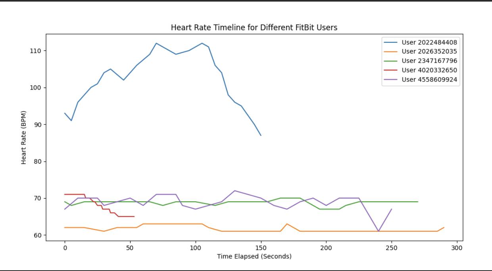
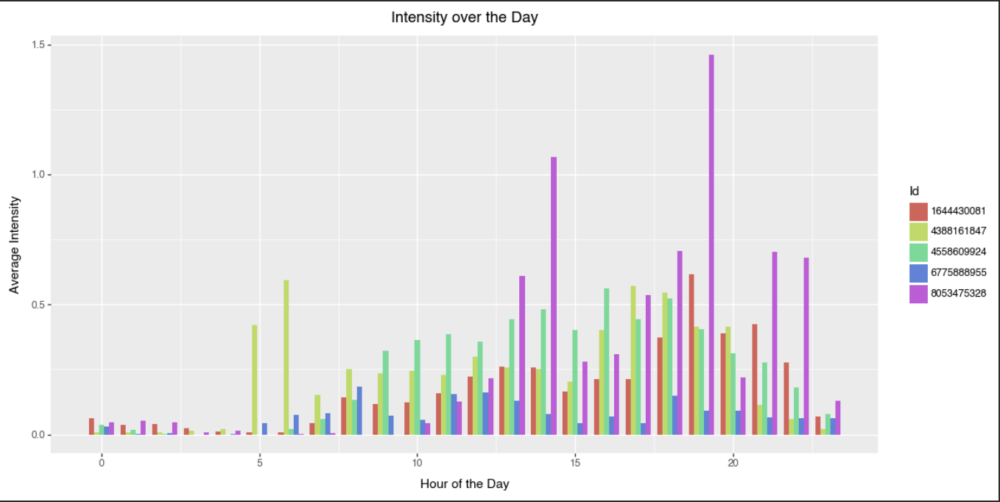
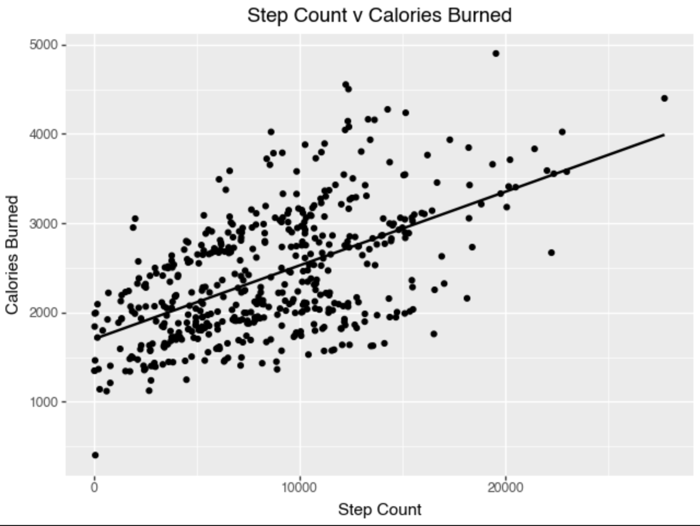

# FitBit Analysis and Plotting

## Project Description
This project uses the [FitBit Activity Dataset](https://www.kaggle.com/datasets/arashnic/fitbit) and performs extreme data manipulation and analysis using various python libraries.
Further, over 8 images with explanations are given in the code to better understand how to both create and analyze visualizations in projects. Example visualizations are given below.

## Results

### Heartrate Timeline

### Intensity Timeline

### Step Count & Calories Dispersion

## License

This project is licensed under the terms of the [MIT License](https://opensource.org/licenses/MIT).